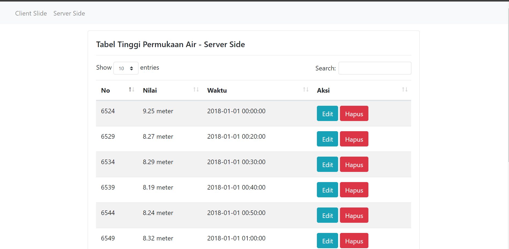

# Datatables x PHP MySQL
In this application we will learn how to present data in table format with the help of the datatables library with data sources from the MySQL database and the PHP.

# Datatables
DataTables is a plug-in for the jQuery Javascript library. It is a highly flexible tool, built upon the foundations of progressive enhancement, that adds all of these advanced features to any HTML table.

# Requirements
https://datatables.net/download/

https://getbootstrap.com/docs/5.0/getting-started/introduction/

